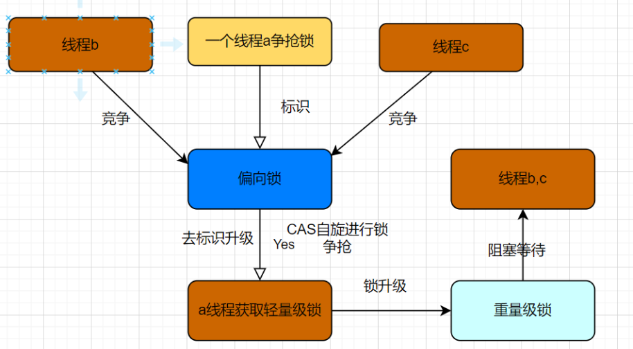

### 1.synchronized锁的升级
1）当只有一个线程去争抢锁的时候,会先使用**偏向锁**,就是给一个**标识**,说明现在这个锁被线程a占有.

2）后来又来了线程b,线程c,说凭什么你占有锁,需要公平的竞争,于是将**标识去掉,也就是撤销偏向锁,升级为轻量级锁**,三个线程通过**CAS自旋**进行锁的争抢(其实这个抢锁过程还是偏向于原来的持有偏向锁的线程).

3）现在线程a占有了锁,线程b,线程c一直在循环尝试获取锁,后来又来了十个线程,一直在自旋,那这样等着也是干耗费CPU资源,所以就将**锁升级为重量级锁**,向内核申请资源,直接将等待的线程进行**阻塞**.


**注：**

**1）偏向锁**
        只有一个线程争抢锁资源的时候.将线程拥有者标识为当前线程。引入了偏向锁目的是来尽可能减少无竞争情况下的同步操作开销。当一个线程访问同步块并获取对象的锁时，会将锁的标记记录在线程的栈帧中，并将对象头中的Thread ID设置为当前线程的ID。此后，当这个线程再次请求相同对象的锁时，虚拟机会使用已经记录的锁标记，而不需要再次进入同步块。

**2）轻量级锁（自旋锁）**
        一个或多个线程通过CAS去争抢锁,如果抢不到则一直自旋。虚拟机会将对象的Mark Word复制到线程的栈帧中作为锁记录，并尝试使用CAS（Compare and Set）操作尝试获取锁。如果CAS成功，则表示线程获取了轻量级锁，并继续执行同步块。如果CAS失败，说明有竞争，虚拟机会通过自旋（spinning）等待其他线程释放锁

**3）重量级锁**
如果自旋等待不成功，虚拟机会将轻量级锁升级为重量级锁。在这种状态下，虚拟机会将线程阻塞，并使用操作系统的互斥量来实现锁的释放和获取。

需要注意的是，锁的升级是逐级升级的过程，而不会存在降级。换句话说，一旦锁升级到更高级别，就不会再回到低级别。

### 2.链表反转
代码实现：
```
public ListNode reverseList(ListNode head) {
    ListNode prev = null;
    ListNode current = head;
    while (current != null) {
        ListNode next = current.next;
        current.next = prev;
        
        prev = current;
        current = next;
    }
    return prev;
}
```

### 3 线程交替打印各自的数字
以下是使用 `wait()` 和 `notify()` 实现的示例代码：

```java
public class AlternatePrinting {
    public static void main(String[] args) {
        final Object lock = new Object();
        Thread threadA = new Thread(new PrintTask("A", lock));
        Thread threadB = new Thread(new PrintTask("B", lock));

        threadA.start();
        threadB.start();
    }

    static class PrintTask implements Runnable {
        private String value;
        private Object lock;

        public PrintTask(String value, Object lock) {
            this.value = value;
            this.lock = lock;
        }

        @Override
        public void run() {
            // 确保线程同步
            synchronized (lock) {
                for (int i = 0; i < 10; i++) {
                    System.out.print(value);
                    lock.notify(); // 唤醒等待的线程
                    try {
                        if (i < 9) {
                            lock.wait(); // 当前线程等待
                        }
                    } catch (InterruptedException e) {
                        e.printStackTrace();
                    }
                }
            }
        }
    }
}
```

在这个示例中，`PrintTask` 实现了 `Runnable` 接口，并且在 `run()` 方法内使用了 `synchronized` 块来确保线程同步。其中，一个线程打印 "A" 后，调用 `lock.notify()` 唤醒另一个等待的线程，然后当前线程调用 `lock.wait()` 进入等待状态，让另一个线程继续执行。

这个示例实现了线程间的交替打印。不过需要注意的是，`wait()` 和 `notify()` 需要在同步块内使用，并且必须配对使用，否则可能会导致线程死锁等问题。实际多线程编程中，还需要考虑更多的细节，如异常处理、线程安全等。


### 4.读取配置的注解知道哪些？(==只回答了@Value==)
在 Spring 框架中，有一些注解用于读取配置信息，这些注解可以帮助您将外部的配置值注入到 Spring 管理的 Bean 中。以下是一些常用的读取配置的注解：

1. `@Value`: 用于将配置值注入到字段、方法参数或构造函数参数中。
   
2. `@PropertySource`: 用于指定属性文件的位置，从中读取配置值。

3. `@ConfigurationProperties`: 用于绑定配置属性前缀到一个 POJO 类中，将属性映射到该类的字段上。

4. `@ConfigurationPropertiesScan`: 用于启用对 `@ConfigurationProperties` 类的扫描。

5. `@EnableConfigurationProperties`: 用于启用特定的 `@ConfigurationProperties` 类。

6. `@ComponentScan`: 用于扫描组件，包括被 `@ConfigurationProperties` 注解的类。

7. `@PropertyMapping`: 用于映射不同环境的配置值。

8. `@ConfigurationPropertyBinding`: 用于自定义类型转换器，将配置值绑定到自定义类型。

9. `@Environment`: 用于访问 Spring 环境属性。

10. `@Autowired` + `Environment`: 通过自动装配 `Environment` 对象来访问环境属性。

这些注解可以根据不同的需求来读取和使用配置信息。通常情况下，使用 `@Value` 注解可以快速地将配置值注入到 Spring Bean 中，而使用 `@ConfigurationProperties` 则更适合将一组配置值绑定到一个 POJO 类中进行统一管理。其他注解则可以根据具体的场景选择使用。

### 5.针对写出的注解，哪些是编译型？哪些是解释型？
在 Spring 框架中，大多数注解都是在运行时（解释型）使用的，而不是在编译时（编译型）。这是因为 Spring 框架通常依赖于反射和运行时动态代理来实现其功能，而这些功能需要在应用程序运行时进行解释和处理。以下是一些常见的 Spring 注解，根据它们的性质进行了分类：

**解释型注解（运行时注解）：**
1. `@Autowired`: 标记要自动装配的依赖项。
2. `@Component`, `@Service`, `@Repository`, `@Controller`: 用于定义 Spring 管理的组件。
3. `@RequestMapping`: 用于映射请求到控制器方法。
4. `@Transactional`: 定义事务的边界。
5. `@Aspect`: 声明一个切面类。
6. `@Scheduled`: 用于指定定时任务的执行时间。
7. `@EventListener`: 用于监听 Spring 事件。
8. `@Value`: 用于将配置值注入到字段或方法参数。
9. `@Profile`: 用于标记在特定环境中激活的 Bean。
10. `@Configuration`: 用于定义配置类。
11. `@ComponentScan`: 用于指定要扫描的组件包。

**编译型注解：**
1. `@ConfigurationProperties`: 用于将配置属性绑定到 POJO 类，但是这是在运行时通过 BeanPostProcessor 完成的。

需要注意的是，虽然很多 Spring 注解在运行时才会被解释和处理，但是 Spring 也支持自定义编译时注解处理器，通过这些处理器可以在编译阶段对注解进行处理，生成一些额外的代码或者进行验证等操作。但是绝大多数 Spring 使用的注解仍然是运行时注解。

### 6.知道哪些线程安全的数据结构？(==juc包里的，回答了currentHashMap==)
线程安全的数据结构是在多线程环境下可以安全地被并发访问和修改的数据结构。这些数据结构内部实现了同步机制，以确保多个线程可以同时访问并修改数据，而不会导致数据不一致或线程安全问题。以下是一些常见的线程安全的数据结构：

1. **ConcurrentHashMap**: 它是线程安全的哈希表，支持高并发的读写操作。它将数据分割成多个段，不同的段可以由不同的线程独立地进行操作。

2. **CopyOnWriteArrayList** 和 **CopyOnWriteArraySet**: 这些数据结构是线程安全的列表和集合，它们的特点是在修改时会复制一份原数据，并在副本上进行修改，从而避免了修改期间的并发问题。

3. **ConcurrentLinkedQueue** 和 **ConcurrentLinkedDeque**: 这些队列和双端队列是无锁的并发数据结构，适用于高并发的生产者消费者场景。

4. **BlockingQueue** 接口的实现类（如 `LinkedBlockingQueue`, `ArrayBlockingQueue` 等）：这些队列在基础的线程安全操作之外，还提供了阻塞操作，适用于协调多线程之间的任务处理。

5. **ConcurrentSkipListMap** 和 **ConcurrentSkipListSet**: 这些数据结构是基于跳表的实现，提供了高效的有序数据存储，并支持高并发的访问操作。

6. **BlockingDeque** 接口的实现类（如 `LinkedBlockingDeque`）：这些双端队列实现了阻塞操作，适用于实现生产者消费者模式。

7. **Atomic 类**: Java 提供了一系列原子类，如 `AtomicInteger`, `AtomicLong`, `AtomicReference` 等，它们通过 CAS（Compare-And-Swap）操作来保证数据的原子性，从而实现了线程安全。

这些线程安全的数据结构在并发编程中非常有用，可以有效地避免多线程环境下的竞态条件和数据不一致问题。然而，在使用这些数据结构时，仍然需要仔细考虑业务逻辑，确保线程安全性。


### 7.String类有扩容机制吗？(==不确定，模糊回答==)
在 Java 中，`String` 类是不可变的，这意味着一旦创建了一个 `String` 对象，其内容就不能被修改。这也意味着 `String` 类没有扩容机制，因为不会对已经创建的 `String` 对象的内容进行修改。

当你对一个已有的 `String` 对象进行操作（如拼接、替换等），实际上是创建了一个新的 `String` 对象，而不是在原始对象上进行修改。这种不可变性有助于确保线程安全，并且对于字符串在各种操作下的行为变得更加可预测和稳定。

对于大量字符串拼接的情况，使用 `StringBuilder`（非线程安全）或 `StringBuffer`（线程安全）类来构建字符串会更加高效，因为它们允许在内部进行可变的操作，而不会频繁地创建新的对象。

虽然 `String` 类本身没有扩容机制，但是在底层，Java 的字符串是通过字符数组来存储的，当字符串长度超过当前字符数组的容量时，会创建一个新的字符数组来存储更长的字符串内容，这种机制实现了类似扩容的效果。这对于开发者来说是透明的，因为这个过程是由 Java 运行时库来管理的。

### 8.hashMap中有优化hash碰撞的措施吗？(==模糊回答，不确定==)
是的，Java 中的 `HashMap` 在处理哈希碰撞（hash collision）时有一些优化措施，主要是通过链地址法和红黑树来处理碰撞。

`HashMap` 内部使用一个数组来存储数据，每个数组元素对应一个桶（bucket），每个桶可以包含一个或多个键值对。当不同的键映射到相同的桶时，发生了哈希碰撞。以下是 `HashMap` 处理碰撞的优化措施：

1. **链地址法（Chaining）**：当多个键映射到同一个桶时，`HashMap` 会使用一个链表来存储这些键值对，使它们在同一个桶内形成一个链表。这种方式适用于碰撞比较少的情况。

2. **红黑树（Red-Black Tree）**：在链地址法的基础上，当同一个桶内的链表长度超过一定阈值（8）时，`HashMap` 会将链表转换为红黑树。这可以提高查找效率，因为红黑树的查找复杂度为 O(log n)。

3. **扩容（Resizing）**：当 `HashMap` 中的元素数量超过一定阈值（负载因子 * 容量）时，`HashMap` 会自动扩容，即重新分配更大的桶数组，并将原有的键值对重新映射到新的桶中。这有助于减少哈希碰撞的概率，提高性能。

4. **移除链表转红黑树的逆操作**：当红黑树节点数小于等于 6 时，`HashMap` 会将红黑树转换回链表，以避免过度的空间开销。

总之，`HashMap` 在处理哈希碰撞时采用了多种优化措施，以确保在不同情况下都能保持较高的性能。然而，需要注意的是，如果哈希函数设计不当或者负载因子过高，仍然可能导致碰撞频繁发生，影响性能。

### 9.redis持久化会发生数据丢失吗？最小粒度是多少？
Redis 是一个基于内存的数据存储系统，它提供了多种持久化方式来确保数据在重启或异常情况下的持久性。然而，不同的持久化方式有不同的数据丢失风险。

Redis 的两种主要持久化方式是：

1. **RDB（Redis Database）持久化**：这种方式通过将数据库的快照写入磁盘来实现持久化。RDB 持久化可以在指定的时间间隔内，或者在满足一定条件时（例如有多少个写操作）进行。虽然 RDB 持久化可以实现较高的性能，但是在发生故障时，可能会导致一定时间范围内的数据丢失。最小粒度是整个数据库。

2. **AOF（Append-Only File）持久化**：这种方式通过将每个写操作追加到一个日志文件中来实现持久化。AOF 持久化可以根据配置的策略，将写操作记录追加到磁盘。在发生故障时，AOF 文件可以被重放，以恢复数据。AOF 持久化相对来说更加安全，但会因为写操作的追加而导致更大的磁盘开销。

Redis 也提供了混合持久化的方式，将 RDB 快照和 AOF 日志结合使用，以实现更好的数据持久性和恢复性。

最小粒度取决于持久化方式。在 RDB 持久化中，**最小粒度是整个数据库**，即一个快照周期内的数据。在 AOF 持久化中，**最小粒度是一个个写操作**，因为每个写操作都会被追加到 AOF 文件中。但需要注意，Redis 并不是实时将每个写操作都写入 AOF 文件，而是根据配置的策略来定期或触发式地写入。

无论哪种持久化方式，都可以根据应用的需求和风险承受程度进行选择和配置，以平衡性能和数据持久性之间的关系。


### 10.redis的基本数据类型有哪些？适用场景分别说说
Redis 支持多种基本数据类型，每种数据类型都有其特定的用途和适用场景。以下是 Redis 的基本数据类型以及它们的适用场景：

1. **String（字符串）**：最基本的数据类型，可以存储字符串、整数、浮点数等。适用于存储单个值，如缓存数据、计数器等。

2. **List（列表）**：有序的字符串列表，可以在列表的两端进行元素的添加和删除。适用于存储一系列按顺序排列的数据，如消息队列、日志数据等。

3. **Set（集合）**：无序的唯一元素集合，支持交集、并集、差集等操作。适用于存储不重复的元素，如标签、好友列表等。

4. **Sorted Set（有序集合）**：与集合类似，每个元素都有一个分数，用于排序，支持范围查询等操作。适用于存储需要排序的数据，如排行榜、计分系统等。

5. **Hash（哈希表）**：类似于关联数组，可以存储字段和值的映射。适用于存储对象属性、缓存数据、存储用户信息等。

6. **Bitmap（位图）**：可以进行位操作的数据结构，适用于存储状态信息，如用户签到情况、在线状态等。

7. **HyperLogLog**：用于进行基数估算的数据结构，适用于统计去重后的元素数量，如统计网站的独立访客数量。

8. **Geospatial Index（地理空间索引）**：用于存储地理位置信息的数据结构，适用于地理位置查询，如附近的人、商店定位等。

每种数据类型在 Redis 中都有自己的一些特性和适用场景。根据您的具体应用需求，选择合适的数据类型可以提高数据访问效率和系统性能。


### 11.sql编写：二年级每个学科的第一名。
这个查询首先通过子查询找出每个学科的最高分数。然后，主查询中的 WHERE 子句将只选择那些二年级且分数等于最高分数的学生。
```
SELECT subject, score, name AS top_student
FROM students
WHERE (grade, subject, score) IN (
    SELECT 2, subject, MAX(score) 
    FROM students 
    WHERE grade = 2
    GROUP BY subject
)
ORDER BY subject, score DESC;

```

### 12. spring中@Autowired的实现原理是什么？
`@Autowired` 是 Spring 框架中用于依赖注入的注解，它可以自动装配（自动注入）一个 Bean 到另一个 Bean 中。`@Autowired` 的实现原理是基于 Spring 的 IoC（控制反转）和 DI（依赖注入）机制。下面是 `@Autowired` 的实现原理：

1. **Bean 的创建和管理：** Spring 使用 IoC 容器来管理对象的创建和生命周期。IoC 容器负责创建、配置和组装 Bean，它在应用程序中负责控制 Bean 的生命周期。

2. **自动扫描和注册 Bean：** 在 Spring 中，通过配置 `@ComponentScan` 注解或 XML 配置文件等方式，可以告诉 Spring 在哪些包下扫描并注册带有 `@Component` 及其派生注解的类为 Bean。

3. **依赖注入：** 当一个 Bean 需要依赖另一个 Bean 时，可以使用 `@Autowired` 注解来自动注入依赖。Spring IoC 容器会自动识别 `@Autowired` 注解，根据类型或名称，在容器中查找匹配的 Bean，并将它注入到需要的地方。

`@Autowired` 实现的主要原理是基于 Java 的反射机制和 Spring 的依赖注入容器。当 Spring 容器创建 Bean 时，它会检查 Bean 类的字段、构造函数和方法参数上是否有 `@Autowired` 注解。如果有，容器会查找匹配的 Bean，并自动将其注入到标注了 `@Autowired` 的位置。

需要注意的是，`@Autowired` 默认按照类型进行匹配注入，如果容器中有多个匹配的 Bean，可以使用 `@Qualifier` 注解指定要注入的 Bean 名称。此外，`@Autowired` 还支持构造函数注入、方法参数注入等不同的注入方式。

总之，`@Autowired` 的实现原理是基于 Spring IoC 容器的依赖注入机制，通过自动扫描、注册 Bean 并根据类型或名称进行匹配，实现了自动装配依赖关系。

### 13. 有时候编码的时候适用@Autowired会有警告，是为什么？
在使用 `@Autowired` 进行依赖注入时，有时候会出现警告，这通常是因为编译器或静态代码分析工具检测到某些潜在的问题或不确定性，可能导致程序运行时的一些意外行为。以下是一些可能出现警告的情况以及可能的解决方案：

1. **多个匹配的 Bean：** 如果有多个 Bean 类型匹配了 `@Autowired` 的字段或参数，编译器会警告你存在歧义性。解决方法是明确指定要注入的 Bean，可以使用 `@Qualifier` 注解来指定 Bean 的名称，或者使用构造函数注入。

2. **循环依赖：** 如果两个或多个 Bean 之间存在循环依赖关系，编译器可能会发出警告，因为这会导致运行时的问题。解决方法是优化 Bean 之间的依赖关系，或者考虑使用懒加载等机制来避免循环依赖。

3. **不可变字段：** 如果 `@Autowired` 注解标记在一个不可变字段（`final` 字段）上，会导致警告。因为不可变字段一旦赋值就不能再修改，但 `@Autowired` 的字段通常需要在构造时进行注入。解决方法是将注入的依赖项通过构造函数参数传递。

4. **访问修饰符：** 如果 `@Autowired` 标记在私有字段上，并且编译器的访问限制较严格，可能会导致警告。解决方法是使用合适的访问修饰符或者提供相应的 getter 和 setter 方法。

5. **可能的空指针异常：** 如果没有找到匹配的 Bean，注入字段可能为 `null`，这会导致空指针异常。编译器可能会提醒你对这种情况进行处理，例如使用 `Optional` 或添加 null 检查。

6. **未配置组件扫描：** 如果你忘记在配置类上添加 `@ComponentScan` 注解或者配置包扫描路径不正确，`@Autowired` 可能无法找到需要注入的 Bean，从而引发警告。

这些警告通常是为了帮助你在编码过程中避免潜在的问题，提高代码质量和可维护性。当出现警告时，你应该仔细检查代码，确保依赖注入的配置正确，Bean 的匹配逻辑明确，依赖关系合理，以及循环依赖等问题得到妥善解决。
